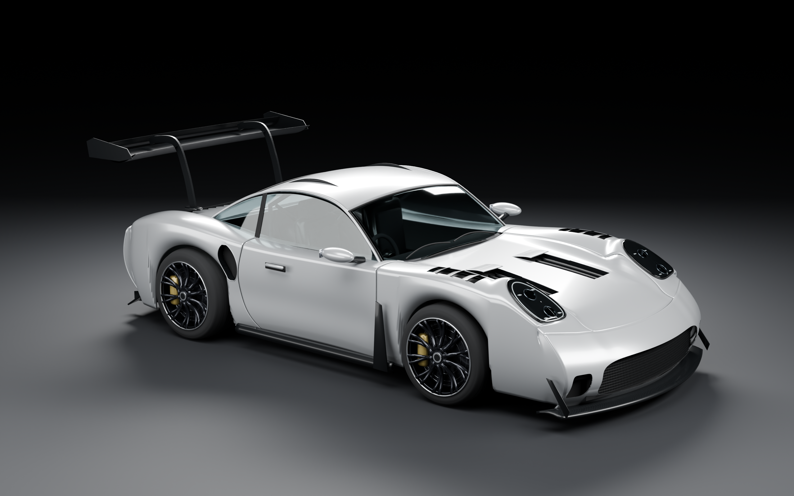

# GT3 RS-inspired Blender model

Original, editable automotive study made for Farnsworth Motors. The user chose
original Blender modeling rather than purchasing a third-party vehicle asset.
This is a visual interpretation, not factory CAD, a scan, or an exact replica.



## Open and use

Open `gt3rs-study.blend` in Blender 4.5 or later. It opens on the assembled
vehicle at frame 270. Play frames 1–270 for the nine-second reconstruction at
30 fps. The hero camera moves from a wider exploded composition to the final
close framing. Separate rear and side inspection cameras are saved too.
`assembly-preview.mp4` is a 1280 × 800 preview rendered from those actual
keyframes, not motion synthesized from a still image. The PNGs are the
higher-resolution 3000 × 1875 inspection renders (160 Cycles samples).

## Refinement pass

The hood/fender height difference is reduced, the hood tapers toward the nose,
and the door seams curve into the sill and line up with the B-pillars. The hood,
fender, rear-quarter, and front-fascia openings are cut through the actual panel
geometry. Duct walls and internal vanes give the vents physical depth. Smooth
source normals are transferred over Boolean-cut paint surfaces.

The wing now has thinner curved swan-neck supports and smaller endplates;
the diffuser, exhausts, and front blades are less bulky. Glass is transmissive,
with modeled perimeter seals and wipers. Broader wheel spokes, revised paint,
and a curved studio cove replace the previous pipe-like wing and hard horizon.
These are geometry/material changes, not a postprocessed image treatment.

The model has 58 semantic components, including two doors, body panels, glazing,
headlamps with clear covers and inner optics, individual wheels/brakes/suspension,
interior and simplified structure, splitter/diffuser, and separate wing elements.
The underlying source uses dense surfaces; web LODs are separate exports.

Materials distinguish metallic paint, carbon, rubber, glass, machined metal,
lamp lenses, and cabin trim. The carbon weave is procedural in Blender. The
studio, cameras, lights, geometry, and keyframes are all editable.

## Reproduce

From the repository root, run Blender in background mode with:

```text
--python src/components/hero/three/pipeline/build_gt3rs_study.py
--python src/components/hero/three/pipeline/verify_gt3rs_study.py
```

Run those as separate invocations, in that order. Add `-- --preview` for quick
1400 × 875 inspection renders in the ignored pipeline verification folder; this
does not overwrite production assets and skips the LOD exports. `-- --draft`
is a lower-resolution build to the production paths, so it must not be packaged.
A normal build creates 3000 × 1875 PNGs; packaging makes 2400 × 1500 WebPs.

Raw GLBs are intermediates. Compress each with glTF Transform `optimize`, using
meshopt and disabling flatten, join, instance, palette, and simplify so part
identity and the Blender-produced LOD geometry survive. Outputs belong under
`public/3d/gt3rs-study/{high,medium,low}.glb`. The verified glTF Transform
version is 4.5.0. After compression, run these in order:

```text
node src/components/hero/three/pipeline/normalize_gt3rs_pivots.cjs
node src/components/hero/three/pipeline/package_gt3rs_study.cjs
node src/components/hero/three/pipeline/verify_gt3rs_web.mjs
```

Pivot normalization preserves the source's named assembly origins while
retaining quantization transforms on child geometry. Animate the named parent
group; do not reset the child's position or scale. Every LOD has 58 semantic
groups and 134 material draw meshes. The default exported pose is assembled.

For a source-only revision, `export_gt3rs_web.py` re-exports the three raw LODs
without rebuilding the geometry or rendering. It intentionally does not save
the temporary decimated scene. `refresh_gt3rs_studio.py` refreshes stills;
append `-- side` (or other camera names) to refresh selected views.

`model-manifest.json` records the source meshes and native animation. The
packaged public manifest converts the transforms to glTF coordinates. The
verification file checks geometry, material assignment, assembly endpoints,
sampled camera framing, and render resolution; it does not prove photorealism.
It also ray-tests both hood ducts for actual depth and checks transmissive
glazing and the studio cove. A higher polygon/sample count is not a substitute
for visual review.
`web-verification.json` additionally decodes each shipped file through Three.js,
checks all stable pivots against the source, and compares bounds against the
raw export. Compression shifts the overall bounds by less than 0.1 mm.

To recreate the preview, run Blender with
`--python src/components/hero/three/pipeline/render_gt3rs_motion.py`, then:

```text
ffmpeg -framerate 30 -start_number 1 -i src/components/hero/three/pipeline/verification/gt3rs-motion/%04d.png -frames:v 270 -c:v libx264 -preset slow -crf 18 -pix_fmt yuv420p -movflags +faststart assets/3d/source/gt3rs-study/assembly-preview.mp4
node src/components/hero/three/pipeline/verify_gt3rs_motion.cjs
```

Frame intermediates remain ignored; only the review movie is kept in source.
Exact static hold frames reuse an identical rendered pose. All moving frames
are rendered in Blender; no optical flow or image-generated motion is used.
`motion-verification.json` records resolution, timing, rendered-pose count,
and the source file hash used by that preview.
The preview uses 80 Cycles samples with OpenImageDenoise; `-- --test` renders
one isolated final-pose check without replacing the preview frames or report.
`-- --start=N` can continue after an interrupted render; use it only when every
earlier numbered PNG is complete and uses this exact source and quality setup.

## Scope and remaining integration

The homepage still uses the older coupe at its original paths. This asset is
kept separate so an incomplete model/fallback transition is not shipped.
The new 58-component layout does not invent rear doors to match the old
44-component vocabulary. Hero binding, matching poster/fallback, record mapping,
web lighting, baked AO, and actual-device performance need an integration pass.
The 134 draw meshes also need profiling on those devices; small file size alone
does not establish smooth runtime performance.

The finished PNGs are actual Cycles renders of this model, not generated concept
images. Source and rendered likeness are artistic approximations; hidden
mechanical details are simplified and must not be presented as repair evidence.

## Provenance

No third-party vehicle mesh, purchased model, game asset, photo texture, or
Porsche CAD was incorporated. Visual references were inspected to understand
the requested silhouette and aero character:

- [Porsche's GT3 RS announcement](https://newsroom.porsche.com/en/2022/products/porsche-911-gt3-rs-world-premiere-29177.html)
- [The marketplace example discussed with the user](https://www.turbosquid.com/FullPreview/2170013)

Those reference photographs/renders are not distributed in this repository.
Our modeling code and original geometry follow the repository license; that
does not grant rights to Porsche trademarks or imply Porsche endorsement.
